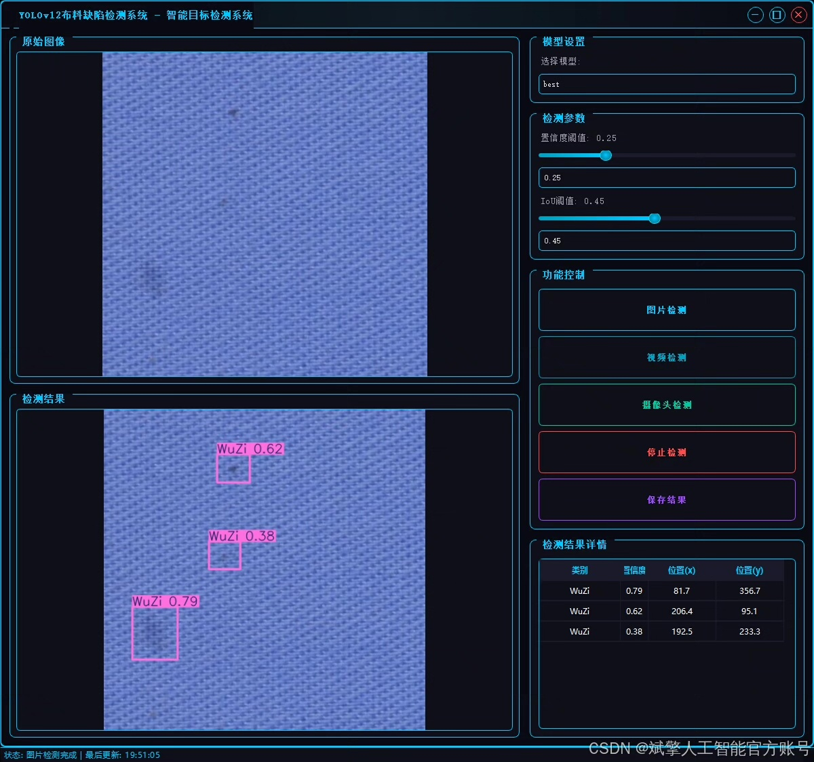
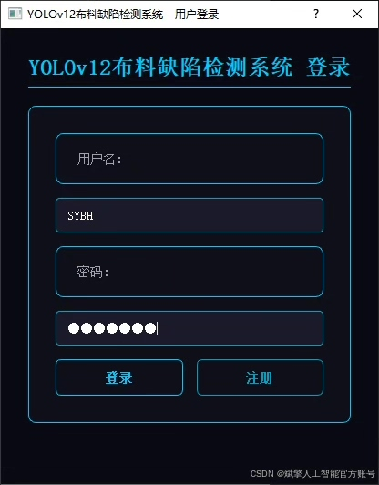
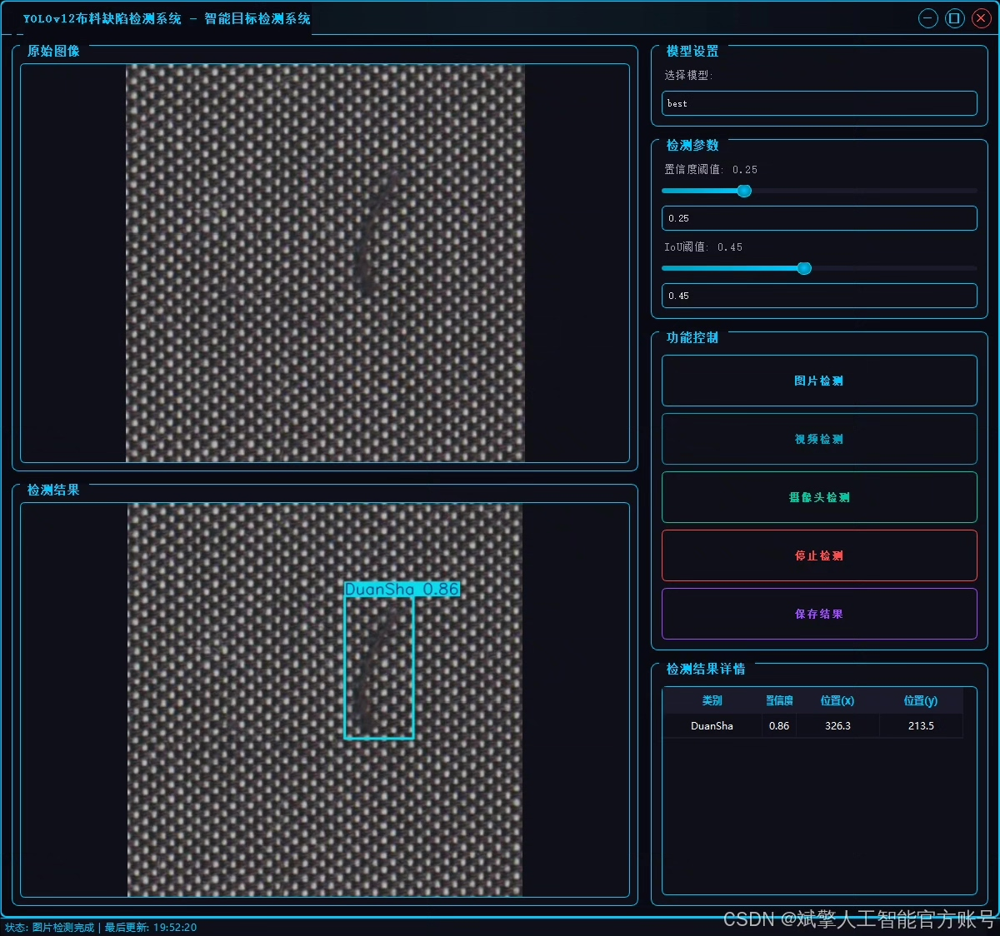
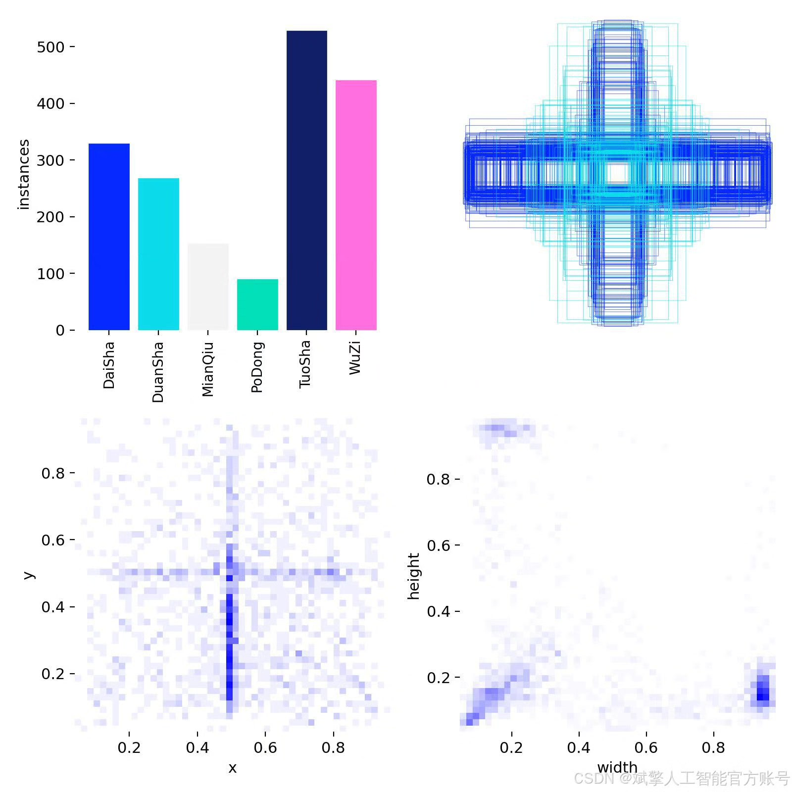
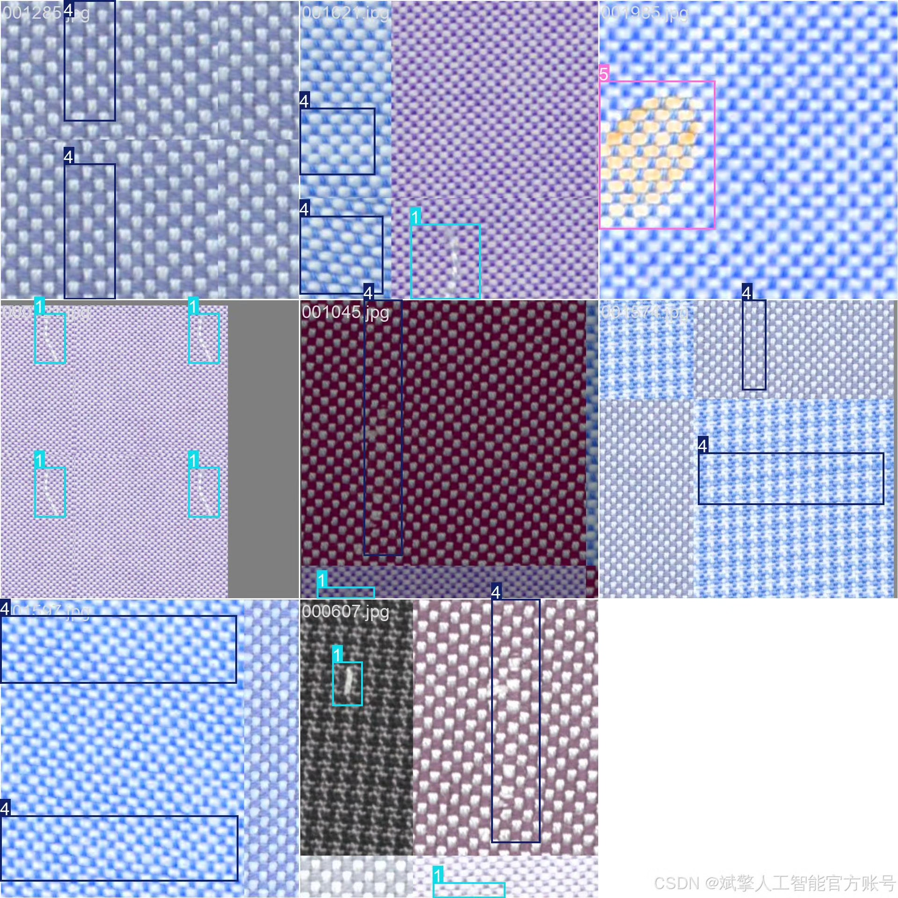
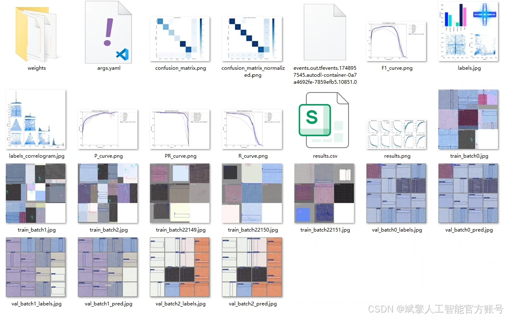
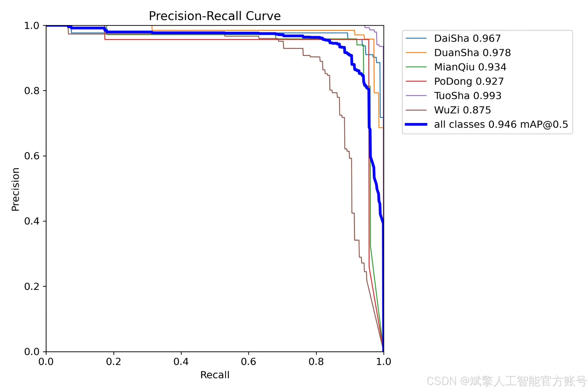
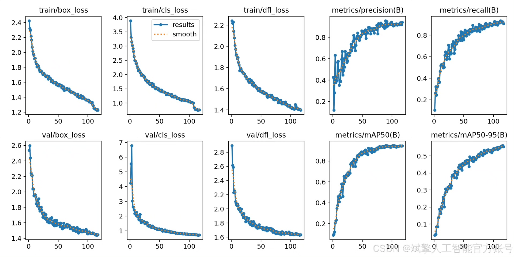
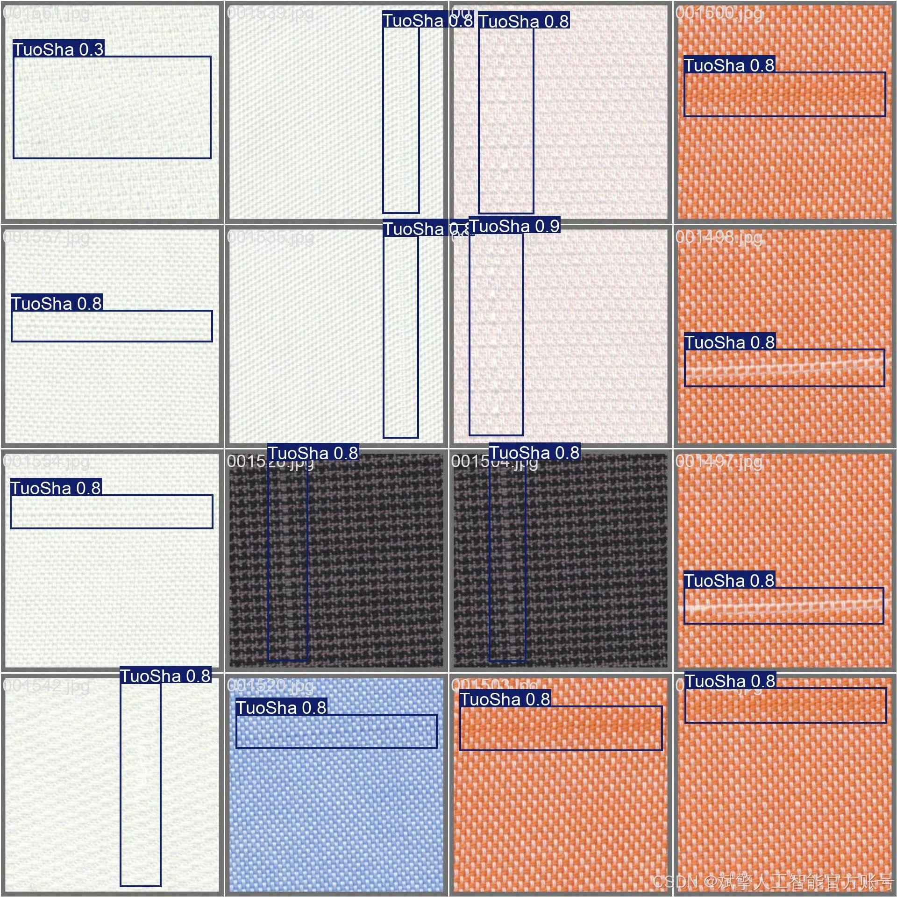

# YOLOv12 fabric defect detection system

## Body

YOLOv12 Fabric Defect Detection System Based on Deep Learning YOLOv12: A Clothing Defect Identification and Detection System (YOLOv12+YOLO dataset + UI interface + login registration interface + Python project source code + model)

This paper designs and implements a deep learning-based fabric defect detection system based on YOLOv12, capable of efficiently identifying six common fabric defects, including "DaiSha" (thread breakage), "DuanSha" (thread severance), "MianQiu" (cotton ball), "PoDong" (puncture), "TuoSha" (delamination), and "WuZi" (dirt). The system employs the YOLOv12 object detection algorithm, combined with an annotated dataset containing 1,650 training images and 467 validation images to ensure the accuracy and generalization capability of the defect detection.

✅ User Login and Registration: Supports password verification and security validation.
✅ Three Detection Modes: Based on the YOLOv12 model, supports image, video, and real-time camera detection, accurately recognizing targets.
✅ Dual-Screen Comparison: Displays the original scene and detection results simultaneously on the screen.
✅ Data Visualization: Real-time table displaying the category, confidence, and coordinates of detected targets.
✅ Intelligent Parameter Tuning: Offers a confidence slide bar for dynamically optimizing detection accuracy, adapting to different scene requirements.
✅ Sci-Fi Interactive Interface: Dark theme paired with dynamic light effects, reducing visual fatigue and enhancing operational experience.

## Images

## Payment

Here is a pay link on Stripe ( https://buy.stripe.com/3cs8yP7sY87d0vu9AB ). Please contact me lonlonago@foxmail.com after funding $89, and I will send you a complete data files , thank you!

